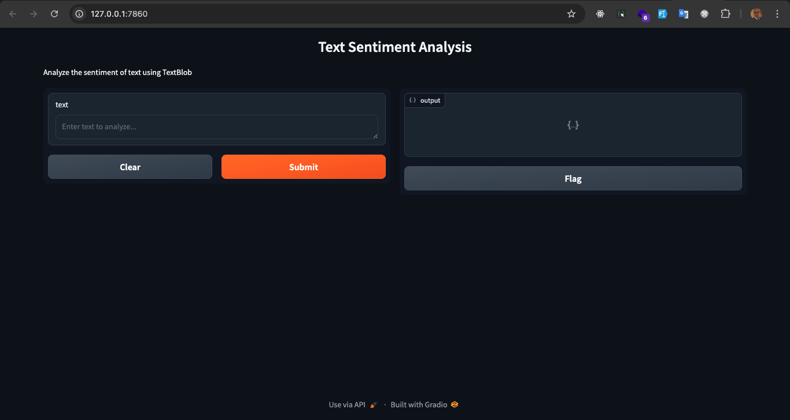

# MCP Sentiment Analysis



This project demonstrates an end-to-end [Model Context Protocol (MCP)](https://github.com/smol-ai/model-context-protocol) sentiment analysis tool using Gradio and TextBlob, deployable to Hugging Face Spaces.

## Features

- Sentiment analysis using TextBlob
- Exposed as an MCP server (Gradio)
- Python and JavaScript client examples
- Ready for Hugging Face Spaces deployment

## Quickstart

### 1. Setup

```bash
python -m venv venv
source venv/bin/activate  # On Windows: venv\Scripts\activate
pip install -r requirements.txt
```

### 2. Run Locally

```bash
python app.py
```

- Web UI: http://localhost:7860
- MCP Server: http://localhost:7860/gradio_api/mcp/sse

### 3. Example Client Usage

#### Python

```python
from smolagents import ToolCollection, CodeAgent
from mcp.client.sse import SSEServerParameters

server_params = SSEServerParameters(url="http://localhost:7860/gradio_api/mcp/sse")
with ToolCollection.from_mcp(server_params, trust_remote_code=True) as tools:
    agent = CodeAgent(tools=[*tools.tools])
    agent.run("What is the sentiment of 'I love working with MCP!'?")
```

#### JavaScript

```js
const response = await mcpClient.call("sentiment_analysis", {
  text: "MCP is amazing!",
});
console.log(response);
```

## Deployment

See [mcp.md](mcp.md) for full instructions, including Hugging Face Spaces deployment and advanced configuration.

---

Check out the configuration reference at https://huggingface.co/docs/hub/spaces-config-reference
